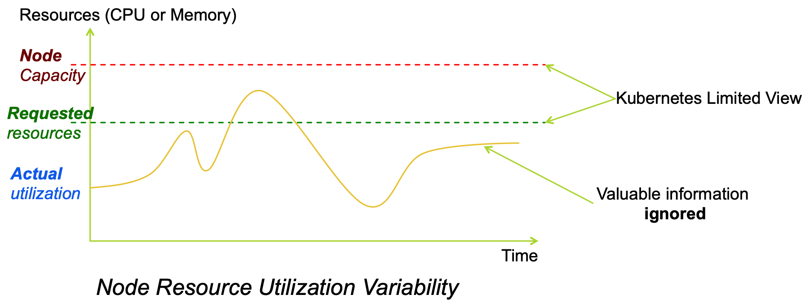
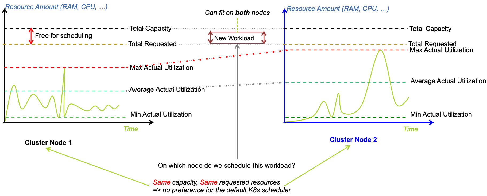
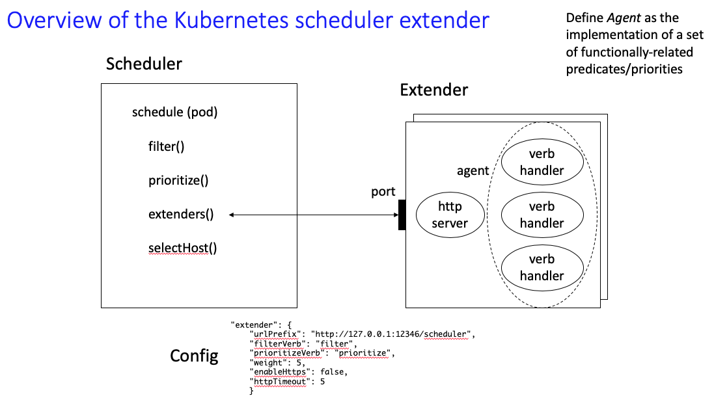
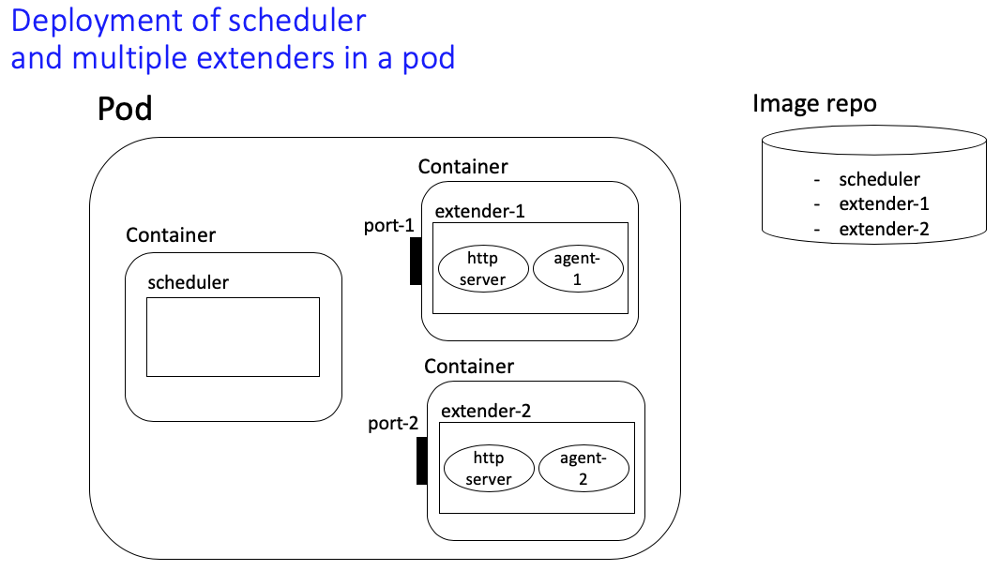
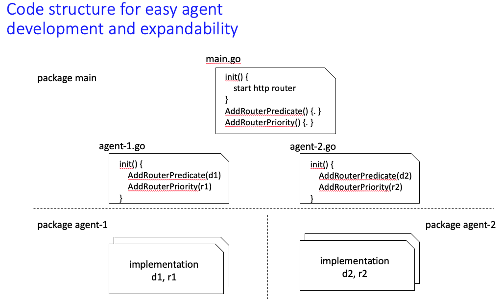
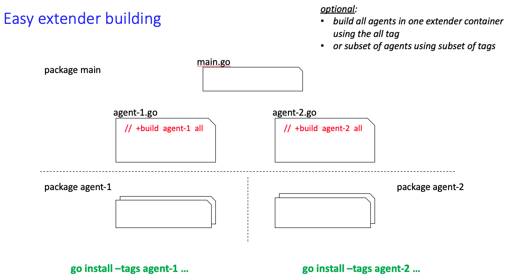

# kube-safe-scheduler

## Motivation

The Kubernetes `default scheduler` offers a lot of value in terms of the vast number of predicates and priorities it implements. Moreover, it is highly configurable, in the sense that we can change the default configuration to one that better matches our needs.



However, there is still room for improvement, and this improvement can be implemented in the form of extensions. For example, as shown in the figure above the default scheduler does not consider the actual utilization of resources of a given node to place a pod. I.e., if two nodes have a capacity of 8 CPUs, and only 5 are requested on each, then the two nodes will be deemed equivalent (assuming everything else is identical) for the default scheduler. However, we can extend to the priority algorithms to favor the node with less CPU actual utilization over a given period of time (e.g. last 6 hours).


Consider the example shown above, from the Kubernetes `default scheduler` perspective, both `Node_1` and `Node_2` are equally favorable for placing a new pod (e.g. requesting only CPU). However, by looking at historical data and the actual CPU utilization on the node, we can clearly see that we can be better performance for the new pod by placing it on `Node_1`. moreover this will further balance the CPU utilization accross the cluster nodes. 

Here, we provide, as an example, a `Safe Scheduler` which targets this issue, as well as having the ability to take risks on nodes with high requests but low actual utilization to maximize efficiency.

We will use this project as an incubator for new Kube scheduler extension ideas. One such idea brewing is to avoid nodes the pod is likely to fail on based on historical evidences.

## Architecture for expanding on the scheduler extender

We provide a solution for allowing the expansion of the scheduler extender to incorporate additional predicates and priority functions, as in the example above. We refer to a collection of predicates and priority functions which tackle a particular objective as an **Agent**. In particular, we include in this project the following agents:

- [Safe balancing and overloading agent](safe/README.md)
- [Policy-based optimizing agent](pigeon/README.md)
- [Node-congestion aware agent](congestion/README.md)
- [Template agent](foo/README.md)

We seek an architecture which (1) allows ease of expandability and introducion of new agents, (2) provides a development environment for an agent, in isolation of other agents, and (3) enables the selective deployment of agents as scheduler extenders. A detailed description is provided [here](docs/ExpandingKubeSchedulerExtender.pdf).

Briefly, the Kubernetes scheduler extender works as follows.



The above is packaged into one pod with multiple containers. One container runs the (default) scheduler. Additional container(s) run the extender(s). Each extender consists of an http server and an agent, implementing its corresponding predicates and priority functions. Each extender container will use a different port. An example with two extender containers follows.



Examples of two agents are provided: [safe](safe/) and [congestion](congestion/). In addition, a template agent [foo](foo/) is also provided. To add an agent, say foo, one needs to:

- Create a file [foo.go](foo.go) in package main. Its sole purpose is to register the agent predicates and prioritiy functions with the router created by [main.go](main.go) as depicted below.

  

  Further, the top line in the file specifies to the go builder a tag name with the name of the agent *foo* (a tag *all* is also added, allowing the building of all the agents if needed) as depicted below. This way the building step of an agent is isolated from any potential issues with other agents.

  

- Create a package [foo](foo/) which includes the implementation of the agent predicates and prioritiy functions. Additional packages may be added.

- Create a Docker [file](dockerfiles/Dockerfile.foo) to build the image for the agent. Notice the inclusion of the tag *foo* in the go install step.

- Create a deployment [yaml](yamlfiles/extender.foo.yaml) file. This file serves several objectives:

  - define the scheduler name (my-scheduler)
  - define the extender configuration, specifying the port number, the predicated and priority functions, as well as their weights.
  - define the pod deployment
  - define the (default) scheduler container
  - Define one or more extender containers, each specifying the name of the agent image and the container port. An example of a pod with a scheduler conainer and two extender containers is [here](yamlfiles/extender.safe.congestion.yaml). Note that container 1 runs the *safe* agent extender on port 5401, whereas container 2 runs the *congestion* agent extender on port 5402. Environment variables for each agent are included, as well as the environment variable HTTP_PORT which defines the port number (default is 80).
  - A note on deployment in clusters with RBAC security: The scheduler needs to run with some privileges in kube-system. A yaml which sets up a service account by the name *extender-serviceaccount* with the required privileges is provided [service-account](yamlfiles/service-account.yaml). If used, one needs to add `serviceAccountName: extender-serviceaccount` to the spec.template.spec of the Deployment in the extender yaml file. The deployment of the service account yaml should precede the deployment of the extender yaml.

## Instructions

Now, we provide instructions to build an agent image, deploy the scheduler extender, and test by placing a pod using the scheduler extender. In the following *xxx* refers to a particular agent of interest. For example, substitutions such as *safe*, *pigeon*, *congestion*, and *foo* are possible.

### 1. buid a docker image

```
$ docker build -f dockerfiles/Dockerfile.xxx -t kube-sched-ext-xxx:0.0 . 
```

### 2. deploy `my-scheduler` in `kube-system` namespace
```
$ kubectl create -f yamlfiles/extender.xxx.yaml
```

If multiple extenders are needed to run simultaneously, then use the corresponding yaml file

```
$ kubectl create -f yamlfiles/extender.xxx.yyy.yaml
```

### 3. schedule test pod

```
$ kubectl create -f yamlfiles/test-pod.yaml

$ kubectl describe test-pod
Name:         test-pod
...
Events:
  Type    Reason     Age   From                   Message
  ----    ------     ----  ----                   -------
  Normal  Scheduled  42s   my-scheduler           Successfully assigned default/test-pod to worker-node1
  Normal  Pulling    41s   kubelet, worker-node1  pulling image "nginx"
  Normal  Pulled     41s   kubelet, worker-node1  Successfully pulled image "nginx"
  Normal  Created    41s   kubelet, worker-node1  Created container
  Normal  Started    40s   kubelet, worker-node1  Started container
```

### 4. inspect logs

The *my-scheduler* pod contains two or more containers. One container, named *my-scheduler-ctr*, runs the default Kubernetes scheduler. Additional containers, named *my-extender-ctr-nnn*, where *nnn* is 1, 2, ... and so on, each runs an extender (http server) and one or more agents, implementing the related predicates and priority functions.  

The following command serves viewing the logs of the scheduler.

```
kubectl logs -f <my-scheduler-...>  -c my-scheduler-ctr -n kube-system
```

And, the following command serves viewing the logs of a particular extender agent (substitute *nnn* by the container number of interest). The log level for the extender is controlled by the *LOG_LEVEL* environment variable. Possible values are: TRACE, DEBUG, INFO, WARNING, ERROR, and ALERT. The default value is INFO.

```
kubectl logs -f <my-scheduler-...>  -c my-extender-ctr-nnn -n kube-system
```
