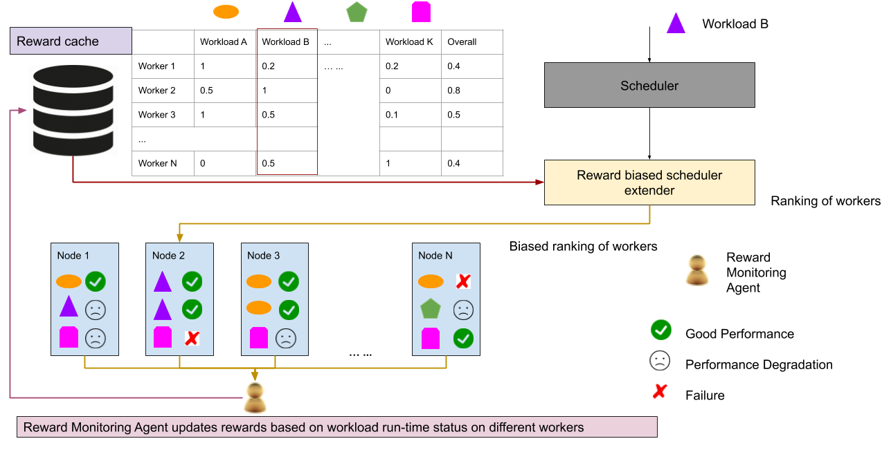
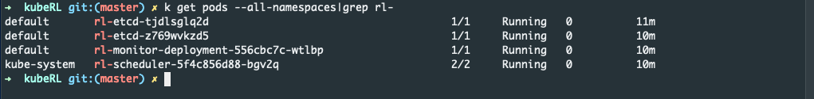

# kubeRL
<!---This is an update repo of https://github.ibm.com/Chen-Wang1/rl-adm-ctl, 
which include various components that implement a reinforcement learning based cluster management framework for Kubernetes clusters. ---> 
`kubeRL` is a software framework implementing a reward biased scheduler extender in Kubernetes. `kubeRL` adopts the idea from reinforcement learning to adaptively learn 
the failures or performance issues of containers and model their runtime performance on nodes as rewards. `kubeRL` then adaptively prevents
scheduling pods on nodes that give low rewards.

## Motivation
Resource scheduling has been intensively studied with multiple objectives. 
Common objectives include maximizing the return of investment of the cloud, 
reducing the power consumption and providing good load balancing, 
while meeting workload performance constraints and resource preferences. 
However, the existing schedulers assume that the workload performance only relies 
 on resources or status that can be accurately monitored. However, accurate resource information about the
the current and future state of the cloud can hardly be obtained. Besides, not all factors impacting the workload
performance can be monitored.

However, from what we observed in production clusters, we find out the following issues.
- Certain types of workloads fail to be scheduled on only a set of nodes due to some issues that are `unknown` to the 
scheduler. 
Such failures are very common in Kubernetes clusters, includes `PersistentVolumeClaim is not bound` (a Persistent
Volume Claim is created without the actual volume created), `Operation cannot be fulfilled on pods/binding ...` 
(A pod is scheduled to a node where the binding operation always fails), `Timeout` (A pod being scheduled 
to a node where the binding requests always time out), etc.

- Certain types of workloads always have poor performance on only a set of nodes due to factors `unobservable` to the scheduler. 
Machines in datacenters may have different hardware configurations, such as the CPU architectures, I/O speed, memory architectures, etc. 
Nodes in a Kubernetes cluster can be a virtual machine with the same t-shirt size, in terms of vcpu and memory size.
However, the same t-shirt size does not guarantee they have the same speed when running the same workload, such as spark or deep learning jobs.
We notice that some spark jobs are always slower on certain nodes though they have been allocated the same amount of resources.
These are performance issues caused by factors that are `unobservable` to schedulers.

`kubeRL` treats workloads as blackboxes, monitors the above failures/performance issues as rewards for those pods during their runtime 
and adaptively prevent scheduling similar pods on nodes that have given low rewards.

## System Overview
The framework should consists of following modules:
<!--- An admission controller that admits/rejects pod requests based on rewards predicted for the pod.-->
- A reward monitoring agent, which monitors a pod's reward on the node it runs on. The reward is supposed to be updated periodically or at runtime to reflect the runtime performance of the pod on a node.
- A reward cache etcd where rewards of pods are evaluated based on their performance/QoS/errors on all different nodes, depending on how a particular application/service defines its reward function.
- A reward biased scheduler extender that bias the scheduling decisions based on rewards that reflect how different pod types perform on different nodes. 

The design of `kubeRL` is shown in the following picture.



The testing environment includes:
- A Kubernetes cluster created by IBM Cloud Kubernetes Service (IKS) with Kubernetes version 1.15.3\_1515.
- A cluster created by `kube-admin`.

<!--As an upgrade from existing projects, the following changes are coming as the v1 of a project to be open sourced:

- The reward biased scheduler (`rl-scheduler-extender`) will be running as a kubernetes scheduler extender instead of kubernetes scheduler.
- Setting up a separate etcd cluster (`rl-etcd`) to keep the reward cache table.
- Setting up kubernetes secretes (`rl-secret`) to keep the etcd cluster ip, username and credentials for easy consumptions by the `rl-scheduler-extender` and the reward monitoring agent (`rl-monitor`).
- The new reward monitoring agent (`rl-monitor`) will be written GoLang, with `client-go 6.0`
- new `rl-scheduler-extender` will be tested in Armada cluster with Kubernetes version 1.15.3_1515.

The above tasks will be marked done when finished. -->

## Deploy `kubeRL`
When you have a Kubernetes cluster set up ready, you can deploy `kubeRL` by `Makefile`.
```shell script
$ make deploy-only
```
You can see several pods with `rl-` prefixes deployed.


## Demo
Now you can run a simple demo to test how `rl-monitor` pod updates the rewards and how `rl-scheduler-extender` bias 
the scheduling decisions for pods arriving after.


## Tutorial for the steps of the demo
You can easily go through the following steps to try the `kubeRL`.
- [Step 1. Set up a Kubernetes cluster, through IKS or `kube-admin`](#step-1-set-up-a-kubernetes-cluster).
- [Step 2: Step 2: Deploy kubeRL.](#step-2-deploy-kuberl).
- [Step 3: Watch logs and caching rewards on `rl-etcd`](#step-3-watch-logs-and-caching-rewards-on-rl-etcd)
- [Step 4: Build and deploy the `rl-demo` to emulate <pod, node> failures.](#step-4-build-and-deploy-the-rl-demo-to-emulate-pod-node-failures).
- [Step 5. Test your `rl-scheduler`](#step-5-test-your-rl-scheduler)

Details of the above steps are given in the followings.
#### Step 1: Set up a Kubernetes Cluster
1. Set up a Kubernetes cluster using [IBM Cloud Kubernetes Service](https://cloud.ibm.com/docs/containers?topic=containers-cs_cluster_tutorial#cs_cluster_tutorial).
2. Or you can set up a Kubernetes Clusters on multiple VMs using `kubeadmin`. Please follow the tutorial
[`Creating a single control-plane cluster with kubeadm`](https://kubernetes.io/docs/setup/production-environment/tools/kubeadm/create-cluster-kubeadm/).

#### Step 2: Deploy kubeRL.
Deploy the `kubeRL` framework.
```shell script
$ cd kubeRL
$ make deploy-only
```
You should now see all pods with `rl-` prefixes created.
```shell script
$ watch 'kubectl get pods --all-namespaces |grep rl-'
```

### Step 3: Watch logs and caching rewards on `rl-etcd`
You can stream logs to your console to study how `kubeRL` works. 
1. Open a terminal to watch `rl-monitor` pod logs.
    ```shell script
    $ kubectl logs -f $(kubectl get pods |grep rl-monitor|cut -d' ' -f1)
    ```
   
2. Open a new terminal and get to the shell of a pod in the cluster to watch the reward changes in `rl-etcd`.
    You first need to get the `rl-etcd-client` endpoint for `rl-etcd`.
    ```shell script
    $kubectl describe service rl-etcd-client
    ```
   
    You can log into a pod in the cluster to watch the rewards cached in `rl-etcd`.
    ```shell script
    $kubectl exec -it shell-demo -- /bin/bash
    ```
    
    When watching rewards in `rl-etcd` for pod type "D", you should be able to see cached rewards updating. 
    Please replace the ip and port to the rl-etcd endpoint CLUSTER-IP and PORT in your cluster.
    ```shell script
    watch -d 'curl -LsS http://172.30.187.125:2379/v2/keys/pods/D |jq .'
    ```

3. Open a terminal to stream the `rl-scheduler-extender` logs to console.
    ```shell script
    $ kubectl logs -f -c rl-scheduler-extender $(kubectl get pods --namespace=kube-system|grep rl-scheduler|cut -d' ' -f1) --namespace=kube-system
    ```

#### Step 4: Build and deploy the `rl-demo` to emulate <pod, node> failures.
`rl-demo` will randomly choose two nodes in the cluster and periodically fail on these nodes with different frequencies, 
one fails every 10 seconds and the other fails every 1 minute.
1. Set up your docker hub ID in `config.env`.
    ```shell script
    USERID=chenw
    ```

2. Build the `rl-demo` image.
    ```shell script
    make build-demo
    ```

3. Deploy the 3 `rl-demo` pods on different nodes using the default kubernetes scheduler. 
    The purpose to deploy `rl-demo` is to emulate pod crashes on different nodes and exam if our `rl-monitor` agent can learn
    failures from pods and update pods' rewards on different nodes accordingly.
    ```shell script
    make demo
    ```
   
    You can watch the states of all `rl-demo` pods to verify how they crash on different nodes.
    ```shell script
    $watch 'kubectl get pods --selector=app=rl-demo'
    ```
    
    When streaming logs for `rl-monitor` pod, you should be able to see rewards of pod type "D" being updated.
    ```shell script
    $ kubectl logs -f $(kubectl get pods |grep rl-monitor|cut -d' ' -f1)
    ```

#### Step 5. Test your `rl-scheduler`.
1. You can now test if your `rl-scheduler` can schedule a new pod according to rewards learned. Let's create a new `nginx` 
    pod under `podtype=D` using `rl-scheduler`
    ```shell script
    kubectl create -f manifests/test-pod.yaml
    ```
   
2. You are expected to see the following when streaming logs from `rl-scheduler`.
    ```shell script
    $ kubectl logs -f -c rl-scheduler-extender $(kubectl get pods --namespace=kube-system|grep rl-scheduler|cut -d' ' -f1) --namespace=kube-system
    ```
